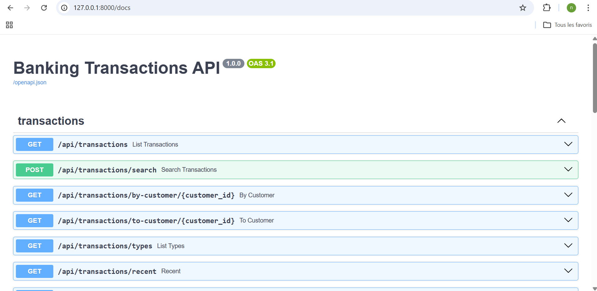
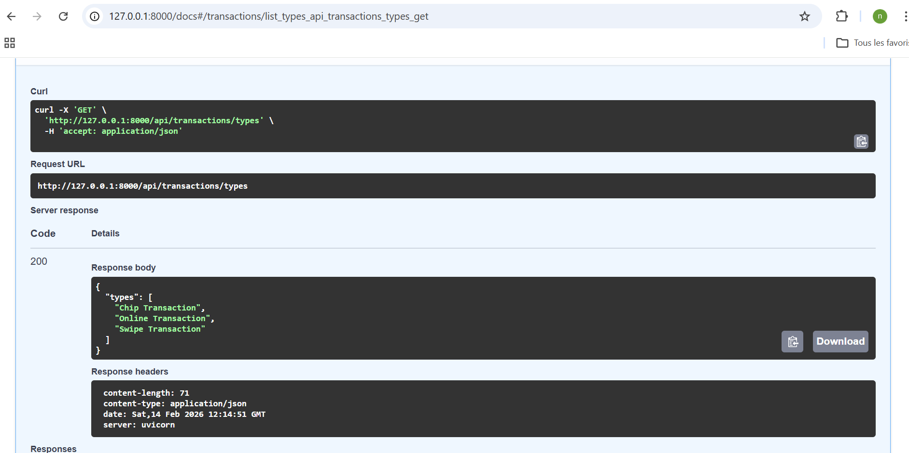
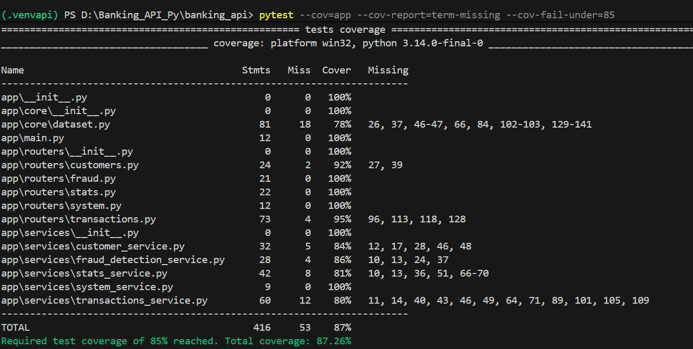
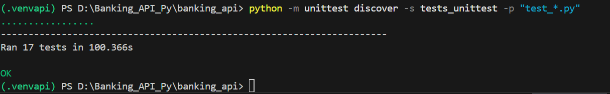
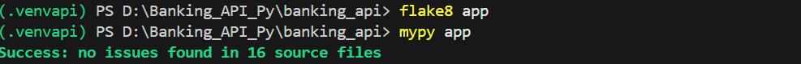
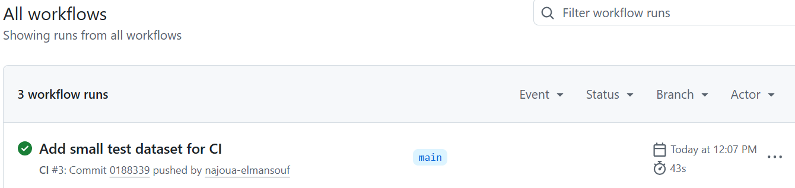

# Banking Transactions REST API

A production-ready REST API built with **FastAPI** for analyzing banking transaction datasets. Designed with clean architecture principles, full test coverage, static type-checking, and a CI/CD pipeline via GitHub Actions.

---

## Features

- **Transaction endpoints** — filter, paginate, and query transactions
- **Fraud detection** — rule-based fraud scoring per transaction
- **Statistics & aggregations** — KPIs computed server-side
- **Customer profiling** — rankings and behavioral metrics per customer
- **System diagnostics** — health-check and dataset metadata

---

## Tech Stack

| Layer | Technology |
|---|---|
| Framework | FastAPI + Uvicorn |
| Data processing | Pandas |
| Validation | Pydantic |
| Testing | Pytest + unittest |
| Type checking | mypy |
| Linting | flake8 (PEP8) |
| CI/CD | GitHub Actions |
| Packaging | Python build (wheel + sdist) |

---

## Project Structure

```
banking-transactions-api/
├── app/
│   ├── core/
│   │   └── dataset.py          # Dataset loading & DATA_DIR resolution
│   ├── routers/
│   │   ├── transactions.py
│   │   ├── stats.py
│   │   ├── fraud.py
│   │   ├── customers.py
│   │   └── system.py
│   ├── services/
│   │   ├── transactions_service.py
│   │   ├── stats_service.py
│   │   ├── fraud_detection_service.py
│   │   ├── customer_service.py
│   │   └── system_service.py
│   └── main.py
├── tests/              # Pytest integration tests (CI dataset)
├── tests_unittest/     # Unittest feature tests
├── docs/images/        # Screenshots
├── requirements.txt
└── pyproject.toml
```

Routers delegate all business logic to dedicated service modules, keeping endpoints clean and testable.

---

## Getting Started

### 1. Clone and create a virtual environment

```bash
git clone https://github.com/sm-elabass/banking-transactions-api.git
cd banking-transactions-api
python -m venv .venv
```

### 2. Activate the environment

```bash
# Windows (PowerShell)
.venv\Scripts\activate

# macOS / Linux
source .venv/bin/activate
```

### 3. Install dependencies

```bash
pip install -r requirements.txt
```

### 4. Add the Kaggle dataset (local development only)

Download the dataset files and place them in a `data/` folder at the project root:

```
data/
├── transactions_data.csv
├── users_data.csv
├── cards_data.csv
├── train_fraud_labels.json
└── mcc_codes.json
```

> CI uses a lightweight sample dataset at `tests/data/` — the full Kaggle files are not committed to the repo.

### 5. Run the API

```bash
# Windows
$env:DATA_DIR="data"
uvicorn app.main:app --reload

# macOS / Linux
DATA_DIR=data uvicorn app.main:app --reload
```

Interactive Swagger UI available at: `http://127.0.0.1:8000/docs`




---

## Testing

### Pytest — unit tests + coverage

```bash
pytest --cov=app --cov-report=term-missing --cov-fail-under=85
```

Minimum coverage requirement: **85%** — current: **≥ 87%**



### Unittest — feature tests

```bash
python -m unittest discover -s tests_unittest -p "test_*.py"
```



---

## Code Quality

```bash
# PEP8 linting
flake8 app

# Static type checking
mypy app
```

All service and router functions are fully type-annotated.



---

## Packaging

```bash
python -m build
# Output: dist/
```

---

## CI/CD — GitHub Actions

Every push triggers the full pipeline:

1. Install dependencies
2. `flake8` lint check
3. `mypy` type check
4. `pytest` with coverage gate
5. `unittest` feature tests
6. Python package build



---

## Dataset Strategy

| Environment | Dataset location | Purpose |
|---|---|---|
| Local dev | `data/` (Kaggle full files) | Full feature testing |
| CI / GitHub Actions | `tests/data/` (lightweight sample) | Fast, reproducible tests |

The `DATA_DIR` environment variable controls which folder is loaded at runtime.
